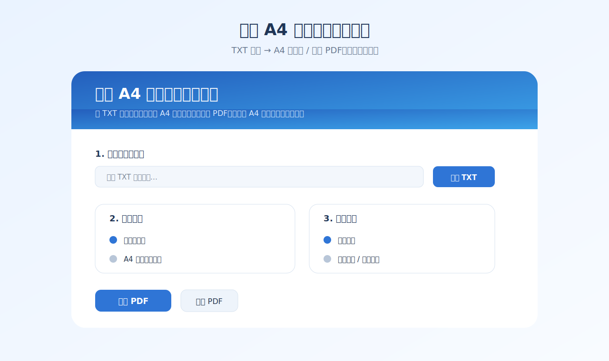

# 小说 A4 自动排版打印工具


一款面向 TXT 小说读者的 Windows 小工具：把普通 TXT 小说自动排成适合 A4 打印的 PDF。默认支持“小册子打印”，也可以生成横向 A4 两栏排版文件。



## 功能亮点

- **一键 TXT 转 PDF**：选择 TXT 后直接生成适合打印的 PDF。
- **小册子打印模式**：默认生成适合打印窗口“小册子”功能的页面。
- **A4 两栏直接打印**：也可以生成一张 A4 已排好左右两栏的 PDF。
- **多种排版模式**：内置黄金设置、省纸模式、舒适阅读三种方案。
- **中文编码友好**：支持自动识别，也可手动选择 GB18030、GBK、UTF-8、UTF-16、BIG5 等编码。
- **自动清理文本**：自动删除多余空行和常见广告行。
- **章节标题优化**：自动识别常见章节标题并居中显示。
- **开箱即用**：Release 提供 Windows 可执行文件和安装包。

## 软件截图


## 下载与安装

进入 GitHub Releases 下载最新版本：

- `NovelA4Printer-vX.X.X.exe`：绿色单文件版，下载后双击即可运行。
- `NovelA4Printer-Setup-vX.X.X.exe`：安装包版本，适合长期使用。

> Windows 可能会提示“未知发布者”。这是因为软件暂未进行代码签名，确认来源为本仓库 Release 后可继续运行。

## 使用方法

1. 打开软件。
2. 点击 **选择 TXT**，选择你的小说文本文件。
3. 如果预览出现乱码，在 **文字编码** 中尝试切换 `GB18030` 或 `GBK`。
4. 选择打印方式：
   - **小册子打印**：适合双面打印后折叠成小册子。
   - **A4 两栏直接打印**：适合普通 A4 横向双栏阅读。
5. 选择排版模式：
   - **黄金设置**：推荐默认方案。
   - **省纸模式**：更小字体、更窄边距，适合长篇小说。
   - **舒适阅读**：字体更大、行距更宽。
6. 点击 **生成 PDF**。
7. 打开 PDF 后打印。

双面打印、小册子打印等选项通常由打印机驱动控制，需要在系统打印窗口中选择。

## 排版参数

| 模式 | 字号 | 行距 | 页边距 | 适合场景 |
| --- | --- | --- | --- | --- |
| 黄金设置 | 9.5 | 1.0 | 10mm | 大多数小说 |
| 省纸模式 | 8.8 | 0.95 | 8mm | 很长的小说、省纸打印 |
| 舒适阅读 | 10.5 | 1.18 | 13mm | 更舒服的阅读体验 |

## 从源码运行

需要 Python 3.10+。

```bash
pip install -r requirements.txt
python novel_printer.py
```

## 自行打包

```bash
pip install pyinstaller
pyinstaller --noconfirm --onefile --windowed --name "NovelA4Printer" --icon "assets/icon.ico" --add-data "assets/icon.ico;assets" novel_printer.py
```

生成文件位于 `dist/NovelA4Printer.exe`。

## 自动发布

本仓库配置了 GitHub Actions。推送形如 `v1.1.0` 的标签，或手动运行 workflow，即可自动构建：

- 单文件绿色版 exe；
- Windows 安装包；
- GitHub Release 说明与截图。

## 版本

当前版本：`v1.1.0`

## 许可证

如果你希望开源发布，建议补充一个 `LICENSE` 文件，例如 MIT License。
